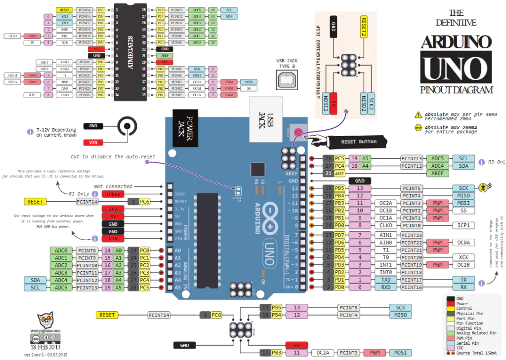
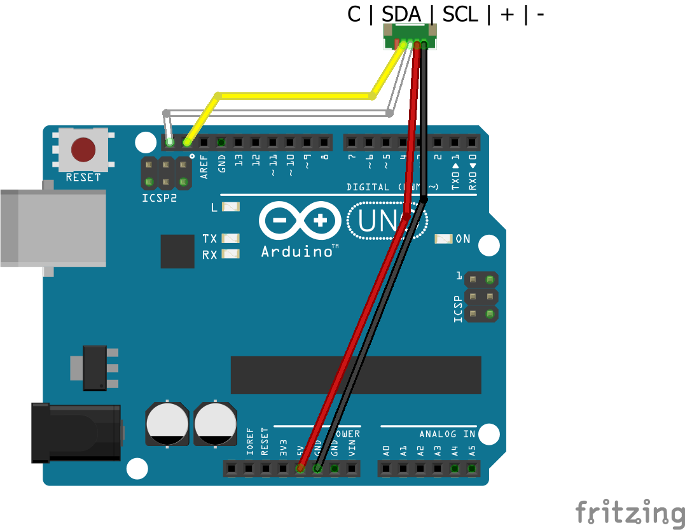

# 🛠️ Taller: Hola Mundo con Arduino UNO y sensor WindQX SA.01

Taller práctico y didáctico de introducción a Arduino UNO. En este taller aprenderás a configurar el entorno de desarrollo, cargar tu primer sketch y conectar el anemómetro de estado sólido WindQX SA.01 para leer velocidad del viento y temperatura ambiente.

---

## 🔌 Arduino UNO — Pinout y características


### Especificaciones técnicas

| Parámetro | Valor |
|---|---|
| Microcontrolador | ATmega328P |
| Tensión de operación | 5 V |
| Tensión de entrada recomendada | 7–12 V |
| Pines digitales I/O | 14 (6 con PWM) |
| Pines de entrada analógica | 6 |
| Corriente DC por pin I/O | 20 mA |
| Corriente DC para pin 3.3V | 50 mA |
| Memoria Flash | 32 KB (0,5 KB para bootloader) |
| SRAM | 2 KB |
| EEPROM | 1 KB |
| Velocidad de reloj | 16 MHz |
| Dimensiones | 68,6 × 53,4 mm |

### Descripción de pines



> **Nota I2C:** En el Arduino UNO, el bus I2C utiliza los pines **A4 (SDA)** y **A5 (SCL)**.

---

## 💻 Instalación del IDE de Arduino en Windows

### Paso 1 — Descargar el instalador

1. Ve a la página oficial: [https://www.arduino.cc/en/software](https://www.arduino.cc/en/software)
2. Haz clic en **"Windows Win 10 and newer, 64 bits"** para descargar el instalador `.exe`.

### Paso 2 — Instalar el IDE

1. Ejecuta el fichero descargado (`arduino-ide_x.x.x_Windows_64bit.exe`).
2. Acepta el acuerdo de licencia y haz clic en **"I Agree"**.
3. Deja las opciones predeterminadas y haz clic en **"Next"** → **"Install"**.
4. Espera a que finalice la instalación y haz clic en **"Finish"**.

### Paso 3 — Instalar drivers del Arduino UNO

> En la mayoría de los casos Windows detecta automáticamente el driver al conectar la placa por USB. Si no ocurre, sigue estos pasos:

1. Conecta el Arduino UNO al ordenador mediante un cable USB tipo B.
2. Abre el **Administrador de dispositivos** (busca "Administrador de dispositivos" en el menú Inicio).
3. Si aparece un dispositivo desconocido, haz clic derecho → **"Actualizar controlador"** → **"Buscar automáticamente"**.

### Paso 4 — Instalar la librería WindQX

La librería es necesaria para comunicarse con el sensor SA.01.

1. Abre el IDE de Arduino.
2. Ve a **Herramientas → Administrar bibliotecas…**
3. Busca `WindQX` en el cuadro de búsqueda.
4. Haz clic en **"Instalar"** junto a la librería **WindQX SolidState Anemometer** de McOrts.

---

## 📂 Cargar y compilar el sketch en el Arduino UNO

### Paso 1 — Abrir el sketch

1. Abre el IDE de Arduino.
2. Ve a **Archivo → Abrir…** y navega hasta el fichero `I2C_ArduinoUNO/I2C_ArduinoUNO.ino` de este repositorio.

### Paso 2 — Seleccionar la placa y el puerto

1. Ve a **Herramientas → Placa → Arduino AVR Boards → Arduino Uno**.
2. Ve a **Herramientas → Puerto** y selecciona el puerto COM que corresponde a tu Arduino (p. ej. `COM3`).

   > Si no ves ningún puerto, asegúrate de que el cable USB está bien conectado y los drivers están instalados.

### Paso 3 — Verificar (compilar) el sketch

1. Haz clic en el botón **✓ Verificar** (o usa el atajo `Ctrl + R`).
2. Espera a que aparezca el mensaje **"Compilación completada"** en la barra inferior.

### Paso 4 — Cargar el sketch en la placa

1. Haz clic en el botón **→ Subir** (o usa el atajo `Ctrl + U`).
2. Espera a que aparezca el mensaje **"Carga completada"**.
3. El LED integrado (pin 13) parpadeará brevemente durante la carga.

### Paso 5 — Monitor serie

1. Ve a **Herramientas → Monitor Serie** (o `Ctrl + Shift + M`).
2. Configura la velocidad en **115200 baudios** (esquina inferior derecha del monitor).
3. Deberías ver las lecturas de viento y temperatura cada 500 ms:

```
0.0 km/h, 22.50°C
0.0 km/h, 22.51°C
...
```

---

## 🔧 Conexión del sensor WindQX SA.01 en protoboard

### Lista de materiales

- [Arduino UNO R3](https://store.arduino.cc/products/arduino-uno-rev3)
- [Anemómetro de estado sólido WindQX SA.01 de ECDSL](https://ecdsl.com/en/categoria-producto/windqx/)
- Protoboard
- Cables Dupont (4 unidades)
- Cable USB tipo B para programar el Arduino

### Tabla de conexiones

| Cable WindQX SA.01 | Color | Pin Arduino UNO |
|---|---|---|
| Alimentación negativa (−) | Negro | GND |
| Alimentación positiva (+) | Rojo | 5V |
| SCL | Blanco | A5 (SCL) |
| SDA | Amarillo | A4 (SDA) |

### Diagrama de conexión en protoboard



### Pasos para el montaje

1. Conecta el cable **negro** (−) del sensor al carril **GND** de la protoboard, y este carril al pin **GND** del Arduino UNO.
2. Conecta el cable **rojo** (+) del sensor al carril **5V** de la protoboard, y este carril al pin **5V** del Arduino UNO.
3. Conecta el cable **blanco** (SCL) del sensor directamente al pin **A5** del Arduino UNO.
4. Conecta el cable **amarillo** (SDA) del sensor directamente al pin **A4** del Arduino UNO.
5. Conecta el Arduino UNO al ordenador mediante el cable USB.
6. Abre el Monitor Serie y comprueba las lecturas.

> **Nota:** El sensor WindQX SA.01 utiliza el protocolo **I2C** (Inter-Integrated Circuit) para comunicarse con el Arduino. Asegúrate de que las conexiones SDA y SCL son correctas para evitar lecturas erróneas.

---

## 📚 Recursos adicionales

- [Repositorio de la librería WindQX](https://github.com/McOrts/WindQX_SolidState_Anemometer)
- [Documentación oficial del Arduino UNO](https://docs.arduino.cc/hardware/uno-rev3/)
- [Página del sensor SA.01 (ECDSL)](https://ecdsl.com/en/categoria-producto/windqx/)
- [Referencia del lenguaje Arduino](https://www.arduino.cc/reference/es/)

---

## 🙏 Agradecimientos

- **Adrián Bracolino** — Creador del dispositivo SA.01.
- **Carlos Orts (McOrts)** — Autor de la librería WindQX y este taller.
